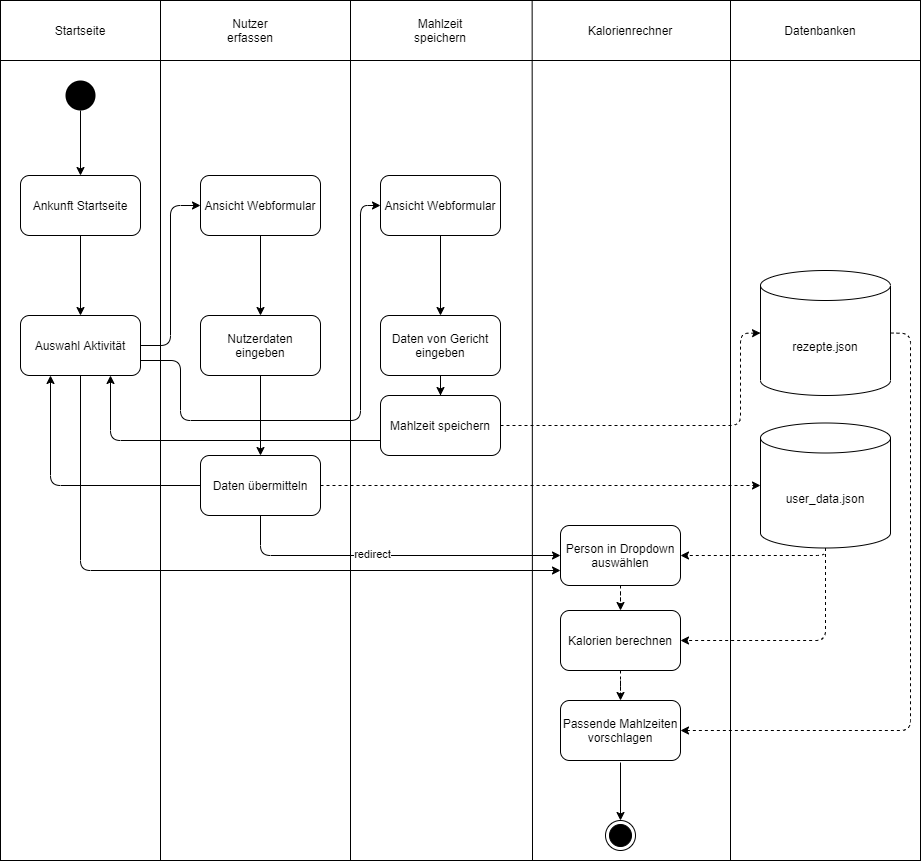

**Beschreibung Webapp "zmettag.li"**

Im Rahmen des Moduls PROG2 hatten wir Studenten den Auftrag, eine Webapp zu erstellen, welche Daten speichern,
verarbeiten und wiedergeben kann.

Meine Idee beruht auf einem Kalorienrechner. Über ein Webformular können Nutzer ihre Daten erfassen, welche
in Folge in eine Datenbank (user_data.json) gespeichert werden.

Die Daten werden jeweils einem Key, generiert aus der Kombination aus Vor- und Nachname zugeordnet und in einem
verschachtelten Dictionary gespeichert.

Über ein weiteres Webformular können Nutzer Gerichte mit der gleichen Logik in eine zweite Datenbank (rezepte.json)
speichern.

**Kalorienrechner**

Entweder manuell oder nach erfolgreicher Nuterdaten-Eingabe ist der Kalorienrechner zugänglich.
Hierbei kann in einem Dropdown eine Person (Key aus user_data.json) ausgewähl werden. Anhand der Eingaben
der jeweiligen Person werden für diese Person dann die Kalorien berechnet und angezeigt.

Anhand einer weiteren Funktion werden basierend auf den errechneten Kalorien in die Kalorien-range passende
Rezepte aus den verschiedenen Kategorien (breakfast, lunch, dinner, snack) ausgewählt und wiedergegeben.

=> In der Funktion wurde definiert, dass die jeweilige Mahlzeit einer Kategorie den definierten, prozentualen
Anteil an den Gesamtkalorien nicht überschreiten darf.
=> Die Funktionalität, dass die Kalorien mit den Mahlzeiten-Vorschlägen möglichst gut ausgenutzt werden, fehlt.
Es wurde lediglicht definiert, dass eine gewisse obergrenze nicht überschritten werden darf. 

**Workflow in Form eines Diagramms**

